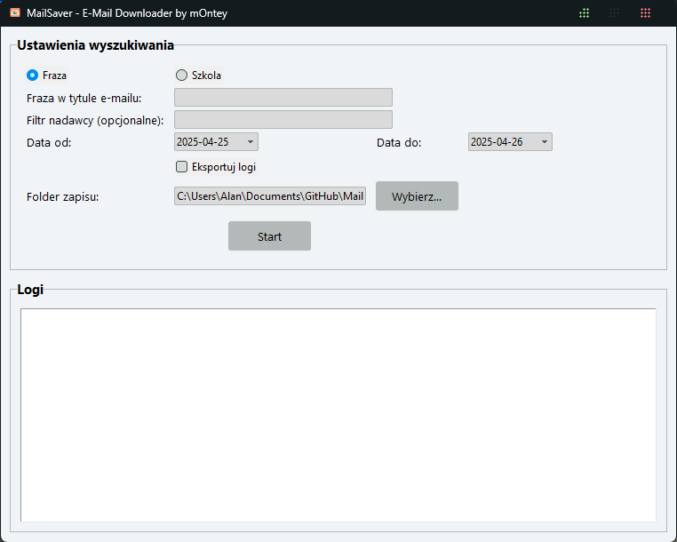

# MailSaver - E-Mail & Drive Downloader by mOntey


## Opis
MailSaver to aplikacja desktopowa napisana w Pythonie (Tkinter + Gmail & Drive API), która umożliwia:

- Pobieranie załączników z Gmail (również dużych plików automatycznie udostępnionych przez Google Drive)
- Filtrowanie wiadomości po frazie lub według klas (prefiksy `1AP`, `2AP`, ..., `2BI`)
- Zakres dat: od dziś do jutra (domyślnie), z możliwością wyboru własnego
- Zapis linków znajdujących się w treści e-maila (`snippet`) w plikach `linki.txt`
- Pobieranie plików udostępnionych dla użytkownika na Dysku Google
- Eksport logów operacji do pliku `logi.txt` w folderze docelowym

## Funkcje

1. **Tryb wyszukiwania:**
   - `Fraza` – wpisz dowolne słowo/zwrot z tytułu maila.
   - `Szkola` – automatyczne filtrowanie klas wg. prefiksów z listy.
2. **Zakres dat:**
   - Domyślnie od dziś, do jutra.
   - Możliwość ręcznego ustawienia dat.
3. **Filtr nadawcy:** opcjonalny, zaawansowany filtr `from:`
4. **Pobieranie załączników:**
   - Małe pliki (AttachmentId + Gmail API)
   - Duże pliki (Drive API, `sharedWithMe`)
5. **Logi:** podgląd w oknie i zapis do `logi.txt`

## Zrzut ekranu



## Wymagania

- Python 3.7+
- Biblioteki:
  ```bash
  pip install google-auth google-auth-oauthlib google-api-python-client tkcalendar
  ```
- Plik `credentials.json` z Google Cloud Console
- Aktywowane API:
  - Gmail API
  - Google Drive API

## Instalacja i konfiguracja

1. Sklonuj repozytorium:
   ```bash
   git clone https://github.com/mOnteySZEF/MailSaver.git
   cd MailSaver
   ```

2. Włącz w Google Cloud Console:
   - **Gmail API**
   - **Google Drive API**

3. Skonfiguruj **OAuth consent screen** i zakresy:
   - `https://www.googleapis.com/auth/gmail.readonly`
   - `https://www.googleapis.com/auth/drive.readonly`

4. Pobierz `credentials.json` i umieść w katalogu projektu.

   > **Uwaga:** Gotowy plik EXE jest dostępny w sekcji **Releases** na GitHub — możesz go pobrać bez potrzeby instalacji Pythona.

5. Usuń ewentualny stary token:
   ```bash
    token.json
   ```

6. Uruchom aplikację:
   ```bash
   python MailSaver.py
   ```

7. Podczas pierwszego uruchomienia zaakceptuj uprawnienia w przeglądarce.

## Użycie

1. Wybierz tryb wyszukiwania (`Fraza` lub `Szkola`).
2. Wpisz frazę lub pozostaw puste (tryb `Szkola`).
3. (Opcjonalnie) ustaw filtr nadawcy.
4. Wybierz zakres dat.
5. Wskaż folder docelowy.
6. Kliknij **Start**.
7. Odbierz pliki i linki w strukturze:
   ```text
   pobrane/
   └── 2BP/
       └── 2BP_Jan_Kowalski_Topic/
           ├── document.pdf
           └── linki.txt
   ```

## Licencja

Projekt dostępny na licencji MIT. Szczegóły w pliku [LICENSE](LICENSE).

---

*MailSaver Made with ❤️ by mOntey*

